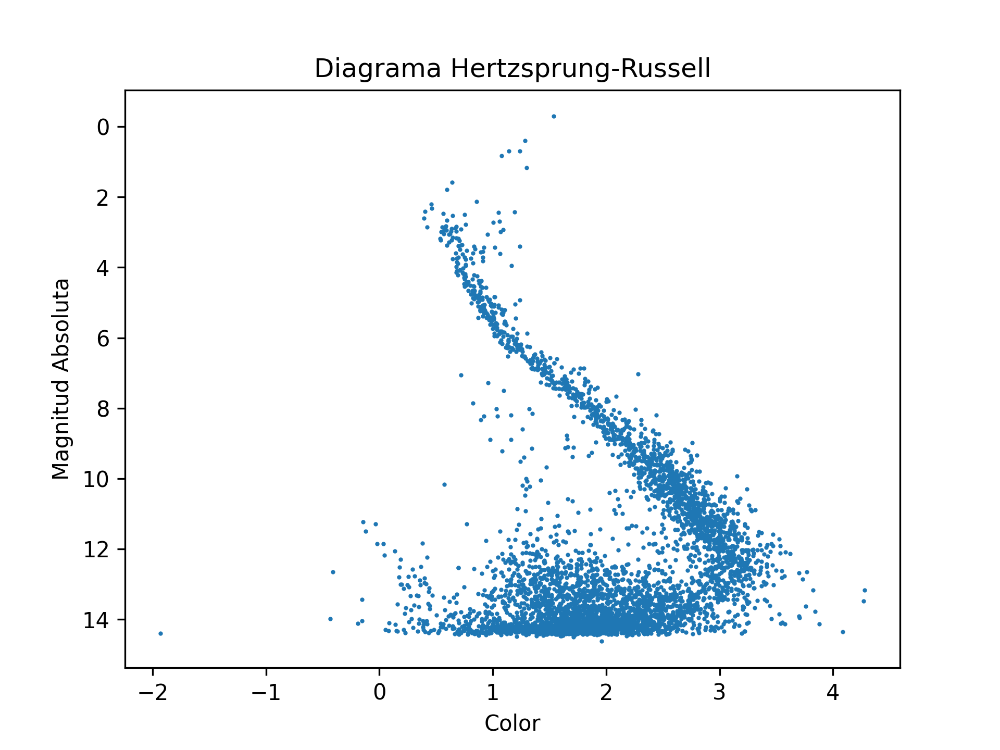

PROYECTO

INTRODUCCIÓN

En este proyecto se estudia un conjunto de datos astronómicos de la misión Gaia DR3 (Evolución Estelar), el objetivo principal es construir un diagrama de Hertzsprung-Rusell para analizar la relación entre el color y la luminosidad de las estrellas.
El análisis se realiza en un pipeline que permite reproducir los resultados sin intervención manual.

METODOLOGÍA

Los datos se obtuvieron desde un endpoint público utilizando un script Bash, esto para garantizar la reproducibilidad.

Después se hizo la limpieza de datos, eliminado registros con valores faltantes y se filtraron valores no físicos (Plx>0)

Se calcularon dos variables importantes:

- Índice de color:

color = BPmag − RPmag

Magnitud absoluta:

M = Gmag + 5 log10(Plx) − 10

Esto con el propósito de ubicar las estrellas en el diagrama de Hertzsprung-Russell

Los datos se almacenaron en una base de datos SQlite(datos_mision.db) y se generó un diagrama de dispersión utilizando Python y Matplotlib

RESULTADOS

El  diagrama de Hertzsprung-Russell fue el siguiente:

El gráfico muestra la distribución de las estrellas en función de su color y luminosidad.

ANÁLISIS FÍSICO
El diagrama muestra una banda diagonal bien definida que corresponde a la secuencia principal. En esta región, las estrellas más calientes (menor índice de color) son más luminosas.

Gigantes rojas

En la parte superior derecha del diagrama se identifican estrellas frías pero altamente luminosas, correspondientes a gigantes rojas.

Regiones inferiores

En la parte inferior del diagrama se observa una alta densidad de estrellas menos luminosas, lo que puede incluir estrellas de baja masa.

CONCLUSIONES
El análisis permite confirmar la relación fundamental entre temperatura y luminosidad estelar. La construcción del diagrama a partir de datos reales demuestra cómo las herramientas mostradas en clase pueden aplicarse al estudio de estructuras astrofísicas.
Además, el uso de pipeline automatizado garantiza la facilidad al reproducir los análisis, lo cual es algo importante en la investigación científica moderna.

